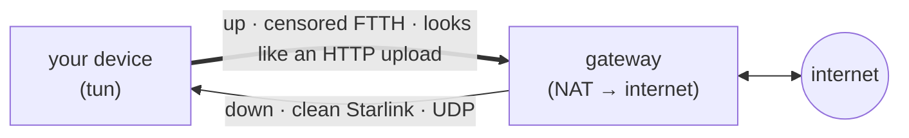
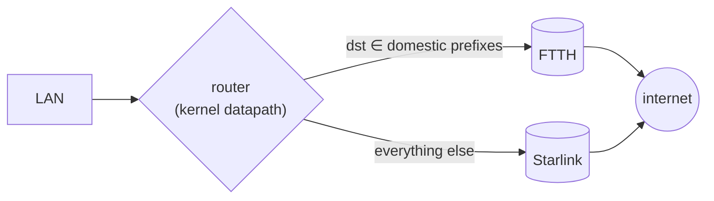
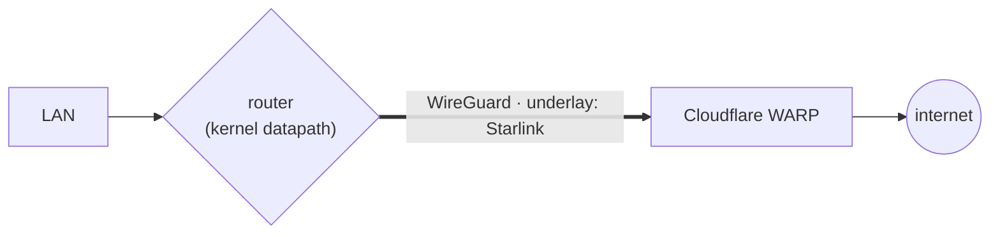
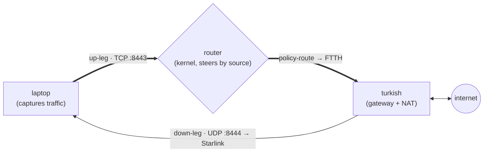
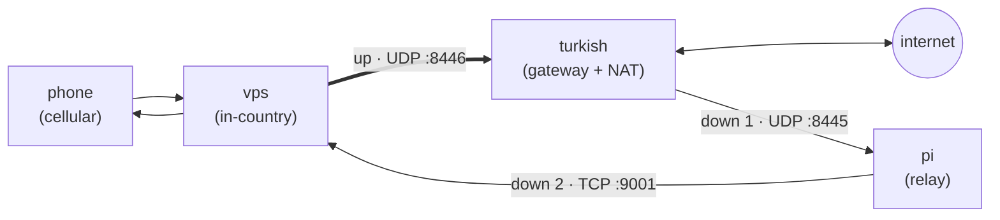

# dualnet

**dualnet** is a single Go binary that runs one **node** in an asymmetric link-bonding VPN
mesh. A node is defined entirely by YAML — a set of **connections** and a **routing table** —
so *client*, *router*, and *gateway* are the same program in three different configurations.

It was built for one hostile-network situation and still does it best:

- **FTTH (fiber)** — fast **uplink**, but **censored** by DPI. Good for *sending*.
- **Starlink** — fast **downlink** (its uplink is jammed), but **not censored**. Good for *receiving*.

Neither link alone gives you a fast, open connection. dualnet sends your traffic **up one link
and receives it back down another**, through a relay that reaches the real internet — so a
download races down Starlink while its ACKs climb FTTH, and each direction rides the link that
is fast for it.



The same mechanism chains across many hops (phone → in-country VPS → out-of-country gateway,
each hop choosing its own link), so the two-node "asymmetric bond" is just the smallest case.

## How it works

A node opens its connections and shuttles packets between them according to a small routing
table. That is the entire runtime — what separates a client, a router, and a gateway is only
the table and the connections, never the code.

Two ideas carry the design:

- **Routing by flow, not by IP.** Every tunnelled flow gets an opaque id, and each inter-node
  packet carries that id plus one bit marking whether it has already been to the internet. A
  routing rule matches on *(the connection a packet arrived on, that bit)* and forwards it to
  another connection. Sending a flow **up one link and back down a different one** is just two
  rules — which is the whole trick.
- **The exit remembers the way home.** Exactly one node per flow is the exit: it releases the
  packet to the real internet and records the return path, so replies find their way back
  across an asymmetric, multi-hop route.

Connections come in three kinds — a local **tun** (where your traffic enters and leaves), a link
you **dial**, or a link you **accept** — carried over three interchangeable transports: **UDP** (a
datagram carrier), **HTTP** (a long-lived upload/download stream that blends into ordinary web
traffic), or **TCP** (that same stream without the HTTP dressing). An optional lightweight cipher
scrambles payloads so content-matching DPI cannot fingerprint them.

> **Security posture — read this.** The **data plane is obfuscation, not encryption**: it defeats
> DPI, not a determined eavesdropper, and it does **not** authenticate inner packets. The
> **control plane is authenticated** — without the shared key, nobody can register a peer or
> hijack/replay a reply path. Resource use is bounded against floods, and the internet egress
> refuses SSRF targets. dualnet is a single-operator tool: treat the tunnel as **unobserved, not
> confidential**. If you need real confidentiality, run TLS/SSH/WireGuard *inside* it.

## Configuration

A node is one YAML file: a `psk`, an `mtu`/`subnet`, its `connections`, and a `routes` table.
You rarely write those by hand — you describe the **whole mesh once** in a network schema and
`dualnet compile` emits one config per node, keeping both ends of every link in sync. Every
example below is a real, runnable schema from [docs/examples/](docs/examples/).

In a schema, **links** and **routes** are one-liners:

- a **link** is `<dialer> <arrow> <acceptor> (<protocol>, <port>)` — the arrow's direction says
  who sends;
- a node's **routes** are an ordered switch-case, `<condition>: <up-links> > (<egress>) >
  <down-links>`, where a lone `(egress)` means "exit to the internet locally, here".

The PSK is never written into a compiled config — it is supplied at runtime via `DUALNET_PSK`.

## Examples

### Geo split on a fast router — [geo-only.yaml](docs/examples/geo-only.yaml)

A pure **kernel-datapath** router: no tunnels, no userspace packet handling. It only programs
the kernel to forward by **destination** — domestic prefixes out the fast domestic link,
everything else out Starlink — so it runs at line rate even on a weak CPU.



### Hide the gateway behind WARP — [kernel-warp.yaml](docs/examples/kernel-warp.yaml)

The same fast router, but its egress is a **Cloudflare WARP** WireGuard tunnel, so destinations
see a Cloudflare address instead of the box's own IP. On a kernel node this is an in-kernel
WireGuard device (line rate); on a userspace node the same egress is fully in-process — no `wg`,
no kernel TUN, no routing-table changes.



### The asymmetric bond — [network.yaml](docs/examples/network.yaml)

The headline setup, five nodes. A laptop captures its own traffic and **bonds** foreign flows
to an out-of-country gateway (**turkish**): the up-leg is source-marked so the home **router**
steers it onto fast-upload FTTH, while the reply returns over clean Starlink. Domestic traffic
exits locally, and if the gateway goes unhealthy the laptop falls back to a direct exit.



The same file also carries an **outdoor path** for a phone off the home network: cellular
reaches an in-country **vps**, which tunnels up to **turkish** for the internet, and replies are
relayed back **turkish → pi → vps** so the phone still gets the home's fast downlink.



A trimmed variant of the outdoor path lives in [simple.yaml](docs/examples/simple.yaml).

## Build

```sh
go build -o dualnet .

# static Linux gateway binary, cross-compiled
CGO_ENABLED=0 GOOS=linux GOARCH=amd64 go build -o dualnet-linux .
```

## Run

Run one node directly:

```sh
export DUALNET_PSK='choose-a-shared-secret'
sudo ./dualnet -config /etc/dualnet/node.yaml
```

Or compile a whole mesh at once, then deploy the per-node configs:

```sh
dualnet compile -network docs/examples/network.yaml -out ./configs/
```

If a client's tun captures the default route, point `connect` links at a remote **IP** (not a
hostname), so DNS does not try to resolve through the not-yet-up tunnel. If large transfers
stall, clamp TCP MSS on the gateway.

## Testing

```sh
go test ./...                                              # unit + full in-process mesh round-trip
go run ./cmd/netsim -network docs/examples/network.yaml    # offline Docker end-to-end (needs Docker)
```

`go test ./...` includes an in-process five-node mesh over real loopback sockets, an adversarial
suite (replay, spoofing, floods, SSRF), and fuzz targets. **netsim** runs the real binary
against a *simulated* internet in Docker — real tun devices, NAT, routing, per-interface binding
— with its test matrix derived from the schema's own paths. See [docs/netsim.md](docs/netsim.md).

## Documentation

| Doc | What's in it |
|---|---|
| [docs/protocol.md](docs/protocol.md) | the wire protocol: envelope, finalizer, healthcheck, kernel datapath |
| [docs/data-flow.md](docs/data-flow.md) | how a config becomes a running node; identity, routing, peer-id assignment; the security model; a concern → file map |
| [docs/netsim.md](docs/netsim.md) | the offline Docker end-to-end simulator |
| [docs/performance.md](docs/performance.md) | the packet hot path and its zero-allocation invariants |

## Status & limits

- **Obscurity-grade security only** — see the security posture above.
- HTTP uplinks make tunnelled TCP into TCP-over-TCP: fine on a low-loss fiber uplink, but prefer
  UDP carriers on non-censored hops and avoid chaining many stream hops.
- A `multiple` listener assumes each downstream peer is a single flow (true for leaf clients);
  deep aggregation behind one peer is future work.
- Inner tun addresses must be unique across the mesh.
- **Greenfield:** single-operator, no live deployment, no backward-compatibility guarantees —
  the wire format and schema may change.
